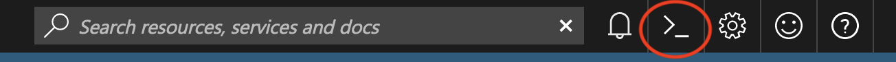

# Lab Environment

## Classroom Setting

These labs are designed for delivery in a classroom setting with the **Azure Global Blackbelt Team.** 

* For these specific labs, we are assuming you will be using your own Azure subscription, as a relatively small set of Azure resources are required.

* Setup Azure Cloud Shell: 

    1. Browse to http://portal.azure.com
    2. Click on the cloud shell icon to start your session.

        

    3. Select `Bash (Linux)`
    4. You will be prompted to setup storage for your cloud shell. Click `Show advanced settings`

        

    6. Provide a unique value for Storage account name. This must be all lower case and no punctuation. Use "cloudshell" for File share name. See example below.

        

    7. Click `Create storage`

    > Note: You can also use the dedicated Azure Cloud Shell URL: http://shell.azure.com 

## Self-guided

It is possible to use your own machine outside of the classroom. You will need the following in order to complete these labs: 

* Azure subscription
* Linux, Mac, or Windows with Bash
* Docker
* Azure CLI
* Visual Studio Code
* Helm
* Kubernetes CLI (kubectl)
* GitHub account and git tools
