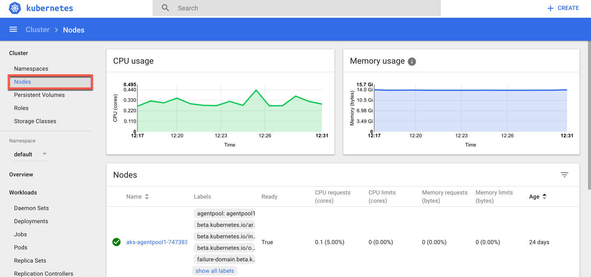
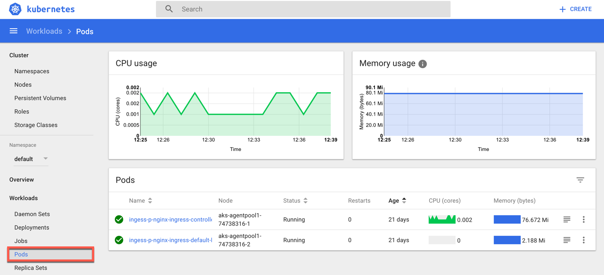

# Kubernetes Dashboard

The Kubernetes dashboard is a web ui that lets you view, monitor, and troubleshoot Kubernetes resources. 

> Note: The Kubernetes dashboard is a secured endpoint and can only be accessed using the SSH keys for the cluster. As the cloud shell runs in a browser, the **Azure CLI** and **kubectl** must be used from your local workstation using the steps below.

* See the following link for installing the **Azure CLI** - https://docs.microsoft.com/en-us/cli/azure/install-azure-cli?view=azure-cli-latest
* See the following link for installing **kubectl** - https://kubernetes.io/docs/tasks/tools/install-kubectl/

### Accessing The Dashboard UI

There are multiple ways of accessing Kubernetes dashboard. You can access through kubectl command-line interface or through the master server API. We'll be using kubectl, as it provides a secure connection, that doesn't expose the UI to the internet.

1. Command-Line using Azure CLI & kubectl

    * Run ```az login``` to authenticate with Azure in order to use Azure CLI from your local workstation
    * Run ```az aks get-credentials -n <Cluster Name> -g <Resource Group Name>``` in order to get the credentials to access our managed Kubernetes cluster in Azure
    * Run ```kubectl proxy```
    * This creates a local proxy to 127.0.0.1:8001
    * Open a web browser and point to: <http://127.0.0.1:8001/api/v1/proxy/namespaces/kube-system/services/kubernetes-dashboard/#!/cluster?namespace=default>

### Explore Kubernetes Dashboard

1. In the Kubernetes Dashboard select nodes to view

2. Explore the different node properties available through the dashboard
3. Explore the different pod properties available through the dashboard 
4. In this lab feel free to take a look around other at  other resources Kubernetes provides through the dashboard

> To learn more about Kubernetes objects and resources, browse the documentation: <https://kubernetes.io/docs/user-journeys/users/application-developer/foundational/#section-3>
